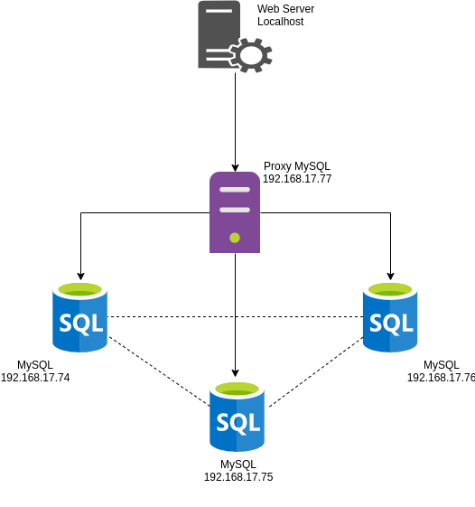

# Desain Infrastruktur

## Gambar

## Spesifikasi

- 3 MySQL Server Ubuntu 18.04 RAM 1024MB IP 192.168.17.74 - 192.168.17.76
- 1 Proxy MySQL Ubuntu 18.04 RAM 1024MB IP 192.168.17.77
- 1 Apache Web Server Ubuntu 18.04 RAM 1024MB Localhost