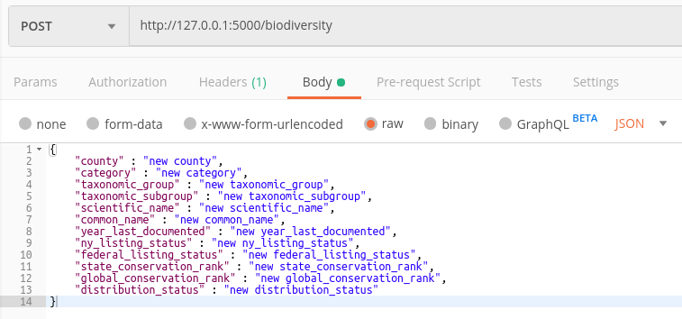
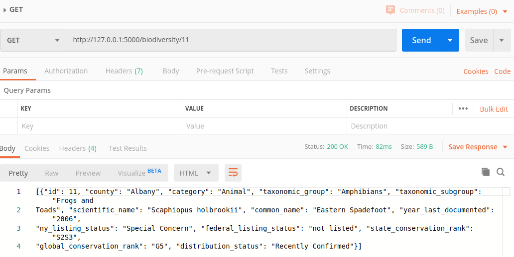
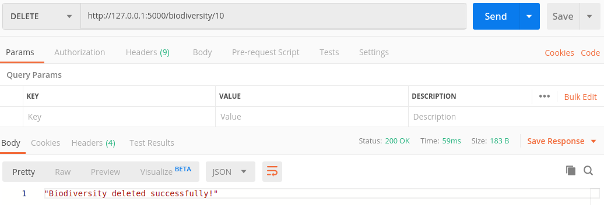
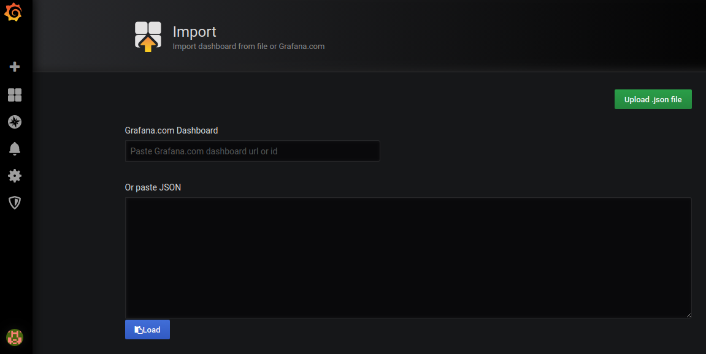
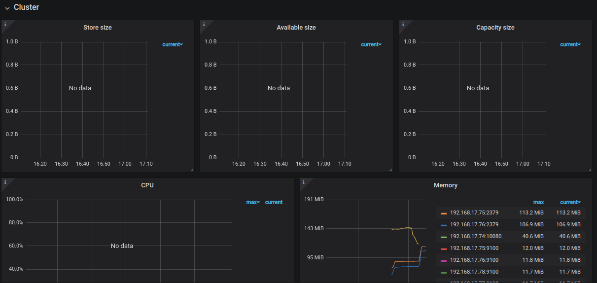
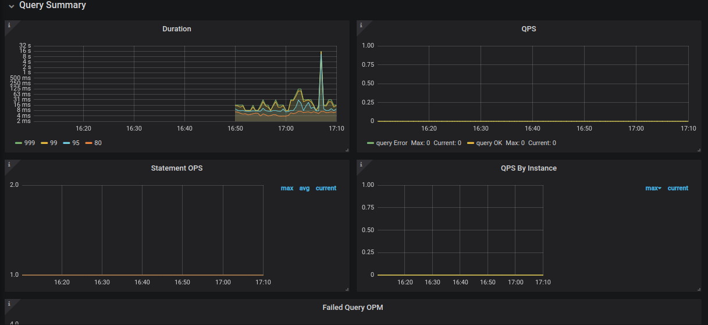
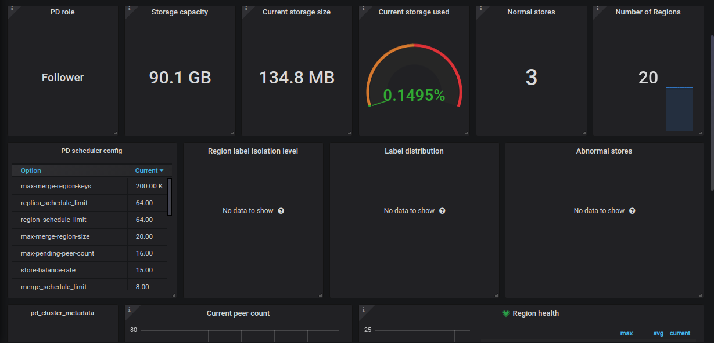
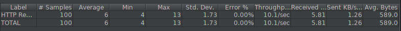
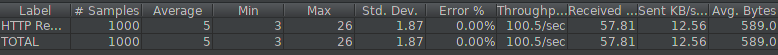
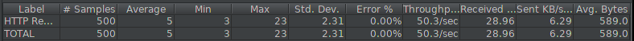

### Evaluasi Akhir Semester

# Clustering pada TiDB

**Bagas Y. Sudrajad**

**NRP : 05111740000074**

## A. Deskripsi Pekerjaan

- Implementasi Arsitektur Sistem Basis Data Terdistribusi TiDB
    - dengan catatan jumlah PD server harus 3
    - Sistem terdiri dari 6 server/node
- Pemanfaatan basis data terdistribusi pada aplikasi (CRUD API)
- Uji Performa
    - Aplikasi -> JMeter (variasi koneksi: 100, 500, 1000)
    - Basis Data -> Sysbench (variasi jumlah server: 1, 2, 3)
- Monitoring Dashboard Dengan Grafana
- Dokumentasi
    - Desain arsitektur (pembagian IP, nama host) & IP menggunakan format X.Y.A.B
        A: Angkatan
        B: NRP
    - Cara penggunaan aplikasi
    - Uji performa
    - Uji fail over


## B. Desain Arsitektur

| NODE  | Sistem Operasi | Memori | IP            | Service                                         |
| ----- | -------------- | ------ | ------------- | ----------------------------------------------- |
| node1 | CentOS 7       | 512 MB | 192.168.17.74 | PD, TiDB, Node Exporter, Grafana dan Prometheus |
| node2 | CentOS 7       | 512 MB | 192.168.17.75 | PD, Node Exporter                               |
| node3 | CentOS 7       | 512 MB | 192.168.17.76 | PD, Node Exporter                               |
| node4 | CentOS 7       | 512 MB | 192.168.17.77 | TiKV, Node Exporter                             |
| node5 | CentOS 7       | 512 MB | 192.168.17.78 | TiKV, Node Exporter                             |
| node6 | CentOS 7       | 512 MB | 192.168.17.79 | TiKV, Node Exporter                             |

## C. Implementasi Virtual Machine Vagrant

1. Membuat vagrant file

   ```bash
   vagrant init
   ```

2. Install plugin `vbguest`

   ```bash
   vagrant plugin instal vagrant-vbguest
   ```

3. Script Vagrantfile untuk membuat 6 node sesuai spesifikasi

   ```ruby
   # -*- mode: ruby -*-
   # vi: set ft=ruby :
   
   Vagrant.configure("2") do |config|
       (1..6).each do |i|
         config.vm.define "node#{i}" do |node|
           node.vm.hostname = "node#{i}"
     
           # Gunakan CentOS 7 dari geerlingguy yang sudah dilengkapi VirtualBox Guest Addition
           node.vm.box = "geerlingguy/centos7"
           node.vm.box_version = "1.2.19"
           
           # Disable checking VirtualBox Guest Addition agar tidak compile ulang setiap restart
           node.vbguest.auto_update = false
           
           node.vm.network "private_network", ip: "192.168.17.#{73+i}"
           
           node.vm.provider "virtualbox" do |vb|
             vb.name = "node#{i}"
             vb.gui = false
             vb.memory = "512"
           end
     
           node.vm.provision "shell", path: "provision/bootstrap.sh", privileged: false
         end
       end
     end
       
   ```

4. Script Provision

   ```bash
   # https://pingcap.com/docs/stable/how-to/deploy/from-tarball/testing-environment/
   # Copy open files limit configuration
   sudo cp /vagrant/config/tidb.conf /etc/security/limits.d/
   
   # Enable max open file
   sudo sysctl -w fs.file-max=1000000
   
   # Copy atau download TiDB binary dari http://download.pingcap.org/tidb-v3.0-linux-amd64.tar.gz
   cp /vagrant/installer/tidb-v3.0-linux-amd64.tar.gz .
   
   # Extract TiDB binary
   tar -xzf tidb-v3.0-linux-amd64.tar.gz
   
   # Install MariaDB to get MySQL client
   sudo yum -y install mariadb
   
   # Install Git
   sudo yum -y install git
   
   # Install nano text editor
   sudo yum -y install nano
   
   # Install node exporter
   wget https://github.com/prometheus/node_exporter/releases/download/v0.18.1/node_exporter-0.18.1.linux-amd64.tar.gz
   tar -xzf node_exporter-0.18.1.linux-amd64.tar.gz
   ```

5. Menjalankan Vagrant

   ```bash
   vagrant up
   ```

6. Clustering TiDB

   Masuk ke node1

   ```bash
   vagrant ssh node1
   ```

   Jalankan perintah berikut

   ```bash
   cd tidb-v3.0-linux-amd64
   ./bin/pd-server --name=pd1 \
                   --data-dir=pd \
                   --client-urls="http://192.168.17.74:2379" \
                   --peer-urls="http://192.168.17.74:2380" \
                   --initial-cluster="pd1=http://192.168.17.74:2380,pd2=http://192.168.17.75:2380,pd3=http://192.168.17.76:2380" \
                   --log-file=pd.log &
   ```

   Masuk ke node2

   ```bash
   vagrant ssh node2
   ```

   Jalankan perintah berikut

   ```bash
   cd tidb-v3.0-linux-amd64
   ./bin/pd-server --name=pd2 \
                   --data-dir=pd \
                   --client-urls="http://192.168.17.75:2379" \
                   --peer-urls="http://192.168.17.75:2380" \
                   --initial-cluster="pd1=http://192.168.17.74:2380,pd2=http://192.168.17.75:2380,pd3=http://192.168.17.76:2380" \
                   --log-file=pd.log &
   ```

   Masuk ke node3

   ```bash
   vagrant ssh node3
   ```

   Jalankan perintah berikut

   ```bash
   cd tidb-v3.0-linux-amd64
   ./bin/pd-server --name=pd3 \
                   --data-dir=pd \
                   --client-urls="http://192.168.17.76:2379" \
                   --peer-urls="http://192.168.17.76:2380" \
                   --initial-cluster="pd1=http://192.168.17.74:2380,pd2=http://192.168.17.75:2380,pd3=http://192.168.17.76:2380" \
                   --log-file=pd.log &
   ```

Masuk ke node4

```bash
vagrant ssh node4
```

Jalankan perintah berikut

```bash
node4
cd tidb-v3.0-linux-amd64
./bin/tikv-server --pd="192.168.17.74:2379,192.168.17.75:2379,192.168.17.76:2379" \
                --addr="192.168.17.77:20160" \
                --data-dir=tikv \
                --log-file=tikv.log &
```

Masuk ke node5

```bash
vagrant ssh node5
```

Jalankan perintah berikut

```bash
cd tidb-v3.0-linux-amd64
./bin/tikv-server --pd="192.168.17.74:2379,192.168.16.75:2379,192.168.16.76:2379" \
                --addr="192.168.17.78:20160" \
                --data-dir=tikv \
                --log-file=tikv.log &
```

Masuk ke node6

```bash
vagrant ssh node6
```

Jalankan perintah berikut

```bash
cd tidb-v3.0-linux-amd64
./bin/tikv-server --pd="192.168.17.74:2379,192.168.16.75:2379,192.168.16.76:2379" \
                --addr="192.168.17.79:20160" \
                --data-dir=tikv \
                --log-file=tikv.log &
```

Masuk ke node1

```bash
vagrant ssh node1
```

Jalankan perintah berikut

```bash
cd tidb-v3.0-linux-amd64
./bin/tidb-server --store=tikv \
                --path="192.168.17.74:2379" \
                --log-file=tidb.log &
```

## D. Pemanfaatan Aplikasi

Aplikasi yang dibuat adalah API dengan bahasa pemrograman python dengan library FLASK. Adapun dataset yang digunakan adalah dataset Biodiversity.

### Operasi Create



### Operasi Read



### Operasi Update


### Operasi Delete



## E. Uji Performa

### Monitoring dengan Grafana

#### Node Exporter, Prometheus, Grafana

Masuk ke setiap node dengan perintah

```bash
vagrant ssh node1
vagrant ssh node2
vagrant ssh node3
vagrant ssh node4
vagrant ssh node5
vagrant ssh node6
```

jalankan perintah berikut pada setiap node

```bash
cd node_exporter-0.18.1.linux-amd64
./node_exporter --web.listen-address=":9100" \
    --log.level="info" &
```

Di node 1, jalankan perintah

```bash
wget https://github.com/prometheus/prometheus/releases/download/v2.2.1/prometheus-2.2.1.linux-amd64.tar.gz
wget https://dl.grafana.com/oss/release/grafana-6.5.1.linux-amd64.tar.gz

tar -xzf prometheus-2.2.1.linux-amd64.tar.gz
tar -zxf grafana-6.5.1.linux-amd64.tar.gz
```

edit  file `prometheus.yml` menjadi seperti berikut

```yml
global:
  scrape_interval:     15s  # By default, scrape targets every 15 seconds.
  evaluation_interval: 15s  # By default, scrape targets every 15 seconds.
  # scrape_timeout is set to the global default value (10s).
  external_labels:
    cluster: 'test-cluster'
    monitor: "prometheus"

scrape_configs:
  - job_name: 'overwritten-nodes'
    honor_labels: true  # Do not overwrite job & instance labels.
    static_configs:
    - targets:
      - '192.168.17.74:9100'
      - '192.168.17.75:9100'
      - '192.168.17.76:9100'
      - '192.168.17.77:9100'
      - '192.168.17.78:9100'
      - '192.168.17.79:9100'

  - job_name: 'tidb'
    honor_labels: true  # Do not overwrite job & instance labels.
    static_configs:
    - targets:
      - '192.168.17.74:10080'

  - job_name: 'pd'
    honor_labels: true  # Do not overwrite job & instance labels.
    static_configs:
    - targets:
      - '192.168.17.74:2379'
      - '192.168.17.75:2379'
      - '192.168.17.76:2379'

  - job_name: 'tikv'
    honor_labels: true  # Do not overwrite job & instance labels.
    static_configs:
    - targets:
      - '192.168.17.77:20180'
      - '192.168.17.78:20180'
      - '192.168.17.79:20180'
```


Jalankan prometheus dengan perintah

```bash
cd ~
cd prometheus-2.2.1.linux-amd64
./prometheus \
    --config.file="./prometheus.yml" \
    --web.listen-address=":9090" \
    --web.external-url="http://192.168.17.74:9090/" \
    --web.enable-admin-api \
    --log.level="info" \
    --storage.tsdb.path="./data.metrics" \
    --storage.tsdb.retention="15d" &
```

Ubah `grafana.ini` dengan perintah

```bash
cd .. && cd grafana-6.5.1
nano conf/grafana.ini
```

Ubah menjadi file berikut

```ini
[paths]
data = ./data
logs = ./data/log
plugins = ./data/plugins
[server]
http_port = 3000
domain = 192.168.16.33
[database]
[session]
[analytics]
check_for_updates = true
[security]
admin_user = admin
admin_password = admin
[snapshots]
[users]
[auth.anonymous]
[auth.basic]
[auth.ldap]
[smtp]
[emails]
[log]
mode = file
[log.console]
[log.file]
level = info
format = text
[log.syslog]
[event_publisher]
[dashboards.json]
enabled = false
path = ./data/dashboards
[metrics]
[grafana_net]
url = https://grafana.net
```

Menjalankan Grafana

```bash
./bin/grafana-server \
    --config="./conf/grafana.ini" &
```

#### pengaturan grafana

Masuk ke aplikasi grafana dengan menuju ke alamat `192.168.17.74:3000` dengan username dan password `admin`

#### Import Dashboard Grafana

`http://192.168.17.74:3000/dashboard/import`



#### Gambar Dashboard








### Uji dengan Sysbench

#### Instalasi

```bash
curl -s https://packagecloud.io/install/repositories/akopytov/sysbench/script.deb.sh | sudo bash    
sudo yum -y install sysbench
git clone https://github.com/pingcap/tidb-bench.git
cd tidb-bench/sysbench
```

#### Pengujian

- `nano config`, sesuaikan konfigurasi untuk host dan db, sesuai dengan node dengan service `tidb`
- persiapkan pengujian dengan perintah `./run.sh point_select prepare `100`
- jalankan sysbench dengan perintah `./run.sh point_select run 100`

#### Hasil Pengujian

- Tiga PD

  ```log
  SQL statistics:
      queries performed:
          read:                            3888655
          write:                           0
          other:                           0
          total:                           3888655
      transactions:                        3888655 (12961.16 per sec.)
      queries:                             3888655 (12961.16 per sec.)
      ignored errors:                      0      (0.00 per sec.)
      reconnects:                          0      (0.00 per sec.)
  
  General statistics:
      total time:                          300.0221s
      total number of events:              3888655
  
  Latency (ms):
           min:                                    0.35
           avg:                                    7.71
           max:                                   71.72
           95th percentile:                       14.73
           sum:                             29996564.31
  
  Threads fairness:
      events (avg/stddev):           38886.5500/88.91
      execution time (avg/stddev):   299.9656/0.01
  ```

  

- Dua PD

  ```log
  SQL statistics:
      queries performed:
          read:                            3763178
          write:                           0
          other:                           0
          total:                           3763178
      transactions:                        3763178 (12542.88 per sec.)
      queries:                             3763178 (12542.88 per sec.)
      ignored errors:                      0      (0.00 per sec.)
      reconnects:                          0      (0.00 per sec.)
  
  General statistics:
      total time:                          300.0234s
      total number of events:              3763178
  
  Latency (ms):
           min:                                    0.35
           avg:                                    7.97
           max:                                   72.34
           95th percentile:                       15.83
           sum:                             29994701.11
  
  Threads fairness:
      events (avg/stddev):           37631.7800/81.44
      execution time (avg/stddev):   299.9470/0.02
  
  
  ```

  

- Satu PD

  ```log
  SQL statistics:
      queries performed:
          read:                            1553492
          write:                           0
          other:                           0
          total:                           1553492
      transactions:                        1553492 (5172.43 per sec.)
      queries:                             1553492 (5172.43 per sec.)
      ignored errors:                      0      (0.00 per sec.)
      reconnects:                          0      (0.00 per sec.)
  
  General statistics:
      total time:                          300.3373s
      total number of events:              1553492
  
  Latency (ms):
           min:                                    1.14
           avg:                                   19.31
           max:                                57214.92
           95th percentile:                       27.66
           sum:                             29992473.56
  
  Threads fairness:
      events (avg/stddev):           15534.9200/38.32
      execution time (avg/stddev):   299.9247/0.10
  ```

## F. Uji JMeter







## G. Uji Fail Over

1. Cek leader dengan perintah

   ```bash
   curl http://192.168.17.74:2379/pd/api/v1/members
   ```

   

2. Matikan service pd1

   cari `pid` service tersebut dengan perintah

   ```bash
   ps -aux | grep pd
   ```

   hentikan dengan perintah

   ```bash
   sudo kil -9 <pid>
   ```

3. Cek kembali apakah posisi leader digantikan

   